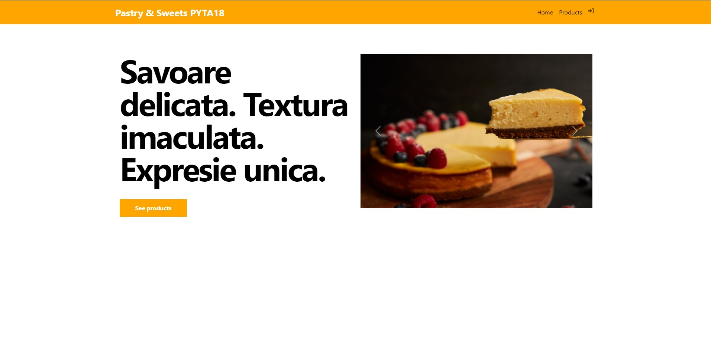

# SWEET_MARKET_PLACE18

**Sweet_Market_Place18** este un magazin online specializat in produse de cofetarie, dezvoltat cu ajutorul limbajului de programare backend Python si s-a implementat frameworkul web Django, s-a utilizat baza de date SqlLite3

## 1. Screenshot Sweet_Market_Place18

## 2. Features Sweet_Market_Place18
* interfata este userfriendly(compatibila pe diferite deviceuri si dimensiuni)
* meniu de navigare - simplu si intuitiv ce ii permite utilizatorului sa acceseze diferite sectiuni ale aplicatiei
* homepage - personalizata, ofera utilizatorului o experienta placuta si imagini despre magazinul online
* gestionare produse - utilizatorii pot naviga pe pagina de produse si ulterior pe pagina produsului, pentru a vedea detalii
* Login/Logout - Register - utilizatorii au optiunea de a se inregistra, autentifica si ulterior pot adauga produse in cos

##  3. Tehnologii si tooluri utilizate
* Python - limbaj de programare
* Django - framework web
* Pycharm - IDE
* SqlLiteStudio si libraria SqlLite3 - baze de date 
* HTML,CSS - creare pagini web si stilizarea acestora

## 4. Instructiuni de instalare
* Cloneaza acest repository local 
link repository github
* Creaza un virtual environment
`python -m venv venv`
* Instaleaza local dependintele proiectului
`pip install -r requirements.txt`

## 5. Utilizarea aplicatiei - se va face pornind serverul de dezvoltare folosind comanda:
`python manage.py runserver`

Acceseaza aplicatia intr-un browser folosind adresa: http://127.0.0.1:8000/

