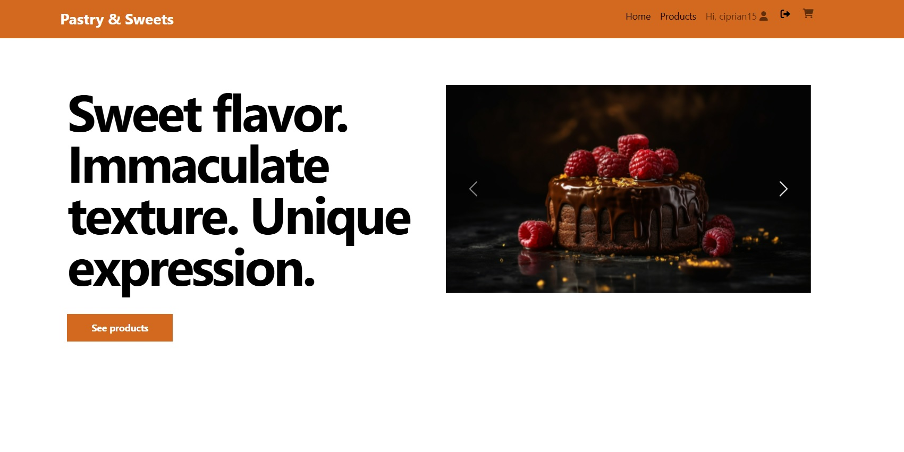

# SWEET_MARKET_PLACE

**Sweet_Market_Place** It is an online store specialized in pastry products, developed with Python backend programming language, Django web framework was implemented and SqlLite3 database was used

## 1. Screenshot Sweet_Market_Place

## 2. Features Sweet_Market_Place
* The interface is user-friendly (compatible on different devices and sizes)
* navigation menu - simple and intuitive that allows the user to access different sections of the application
* homepage - personalized, offers the user a pleasant experience and images about the online store
* product management - users can navigate to products page and subsequently to page product for more details
* Login/Logout - Register - users have the option to register, login and later add products to cart

##  3. Tools and technologies used
* Python - programming language
* Django - framework web
* Pycharm - IDE
* SqlLiteStudio and SqlLite3 library - database 
* HTML, CSS - creating web pages and styling

## 4. Installation instructions
* Clone this local repository:
https://github.com/CiprianSimionov/sweet_market_place.git
* Create a virtual environment:
`python -m venv venv`
* Install locally the project dependencies:
`pip install -r requirements.txt`

## 5. How to use the application - starting the server using the command:
`python manage.py runserver`

* Access the application in a browser using the following url: http://127.0.0.1:8000/

